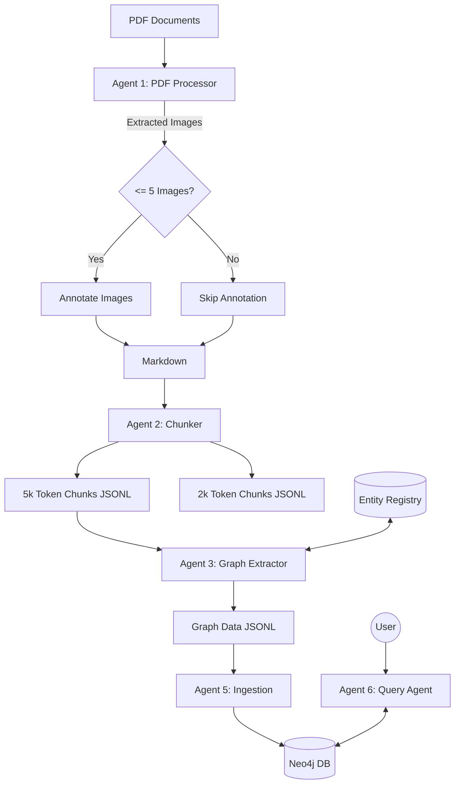

# Multimodal Knowledge Graph Pipeline Roadmap

This plan outlines the steps to upgrade the existing agentic workflow to meet the requirements for processing research papers, building a knowledge graph, and enabling Q&A.

## 1. Upgrade PDF Processor Agent (Agent 1)

**File:** [`agents/1-pdf_processor_agent.py`](agents/1-pdf_processor_agent.py)

- **Goal:** Intelligent image annotation.
- **Changes:**
  - Modify `convert_pdf_to_markdown_tool` to count extracted images in the output directory.
  - Implement logic: IF image_count <= 5 THEN trigger `annotate_markdown_tool` ELSE skip.
  - Support batch processing of multiple PDFs from the `data/` directory.

## 2. Upgrade Chunker Agent (Agent 2)

**File:** [`agents/2-chunker_agent.py`](agents/2-chunker_agent.py)

- **Goal:** Dual-granularity chunking.
- **Changes:**
  - Switch to token-based splitting (using `tiktoken`) to ensure accurate "5000 token" and "2000 token" sizes.
  - Output two JSONL files per document:
    - `{doc}_chunks_5k.jsonl` (for Graph Construction)
    - `{doc}_chunks_2k.jsonl` (for RAG/Search)

## 3. Upgrade Graph Data Extractor (Agent 3)

**File:** [`agents/3-graph_data_extractor_agent.py`](agents/3-graph_data_extractor_agent.py)

- **Goal:** Context-aware entity extraction across documents.
- **Changes:**
  - Implement a `GlobalEntityRegistry` (saved as JSON) to persist seen entities across different documents.
  - Load this registry before processing each document so the LLM knows which entities already exist ("attention mechanism" -> "Attention").
  - Target the `_5k.jsonl` chunk files for extraction.

## 4. Graph Ingestion Agent (Agent 5)

**File:** [`agents/5-jsonl_graph_ingestion_agent.py`](agents/5-jsonl_graph_ingestion_agent.py)

- **Goal:** Batch ingestion.
- **Changes:**
  - Ensure it iterates through all generated `*_graph.jsonl` files and uploads them to Neo4j.

## 5. Create Graph Query Agent (New Agent 6)

**File:** `agents/6-graph_query_agent.py`

- **Goal:** Question Answering.
- **Implementation:**
  - Create a new agent using LangChain's `GraphCypherQAChain` (or similar).
  - It will accept a natural language query ("tell me about attention"), generate Cypher, execute it against Neo4j, and synthesize an answer.

## 6. Create Pipeline Orchestrator

**File:** `main_pipeline.py`

- **Goal:** End-to-end automation.
- **Implementation:**
  - A master script that sequentially calls Agents 1 -> 2 -> 3 -> 5 for all PDF files in the `data/` folder.
  - Handles the flow of filenames and status updates.

## Diagram

